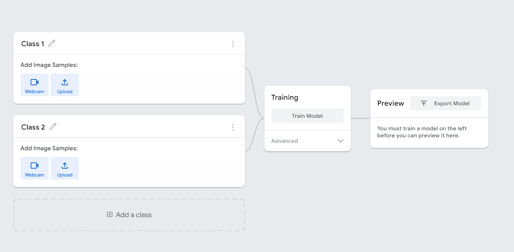
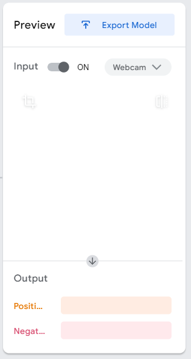
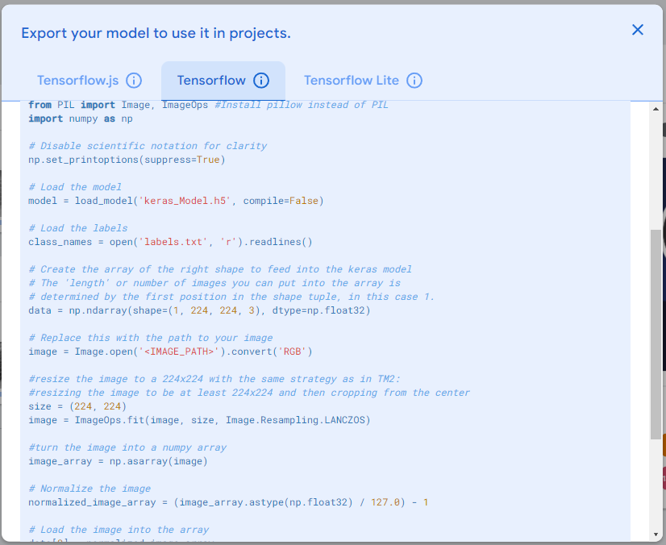

# Muốn ăn ngon nhưng lười code

## Hướng dẫn
* Vô [Teach Able Machine](https://teachablemachine.withgoogle.com/train) của google để tạo model.
* Chọn Image Project hoặc (Audio Project cho âm thanh).
* Với mỗi Class thì ta thêm hình ảnh để cho máy nó học.

* Ấn **Training** để train model
* Ta có thể thử model tại đây

* Muốn xuất model thì chọn **Export Model** để cóp code:))

